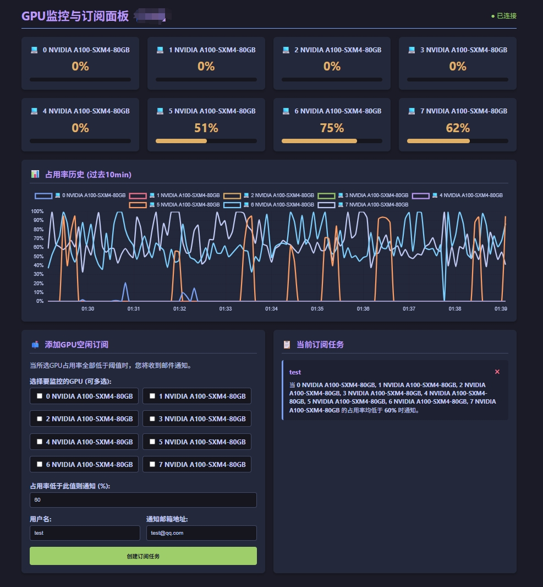

# 🚀 GPU 监控与订阅面板

一个基于 FastAPI + WebSocket 的简洁高效的 GPU 实时监控与邮件订阅系统，适用于实验室/团队服务器的 GPU 占用率可视化与空闲提醒。

---

## 🛠️ 安装指南

1. **克隆项目**

   ```bash
   git clone https://your.repo.url/gpu-free.git
   cd gpu-free
   ```
2. **创建虚拟环境（推荐）**

   ```bash
   python -m venv venv
   source venv/bin/activate  # Windows: venv\Scripts\activate
   ```
3. **安装依赖**

   ```bash
   pip install -r requirements.txt
   ```

   依赖说明：

   - `fastapi[all]`：Web 框架及相关依赖
   - `uvicorn`：ASGI 服务器
   - `pynvml`：NVIDIA GPU 监控
   - `psutil`：系统资源监控

---

## 🚦 启动与部署

1. **本地开发启动**

   ```bash
   python main.py
   ```

   或

   ```bash
   uvicorn main:app --host 0.0.0.0 --port 8200 --reload
   ```
2. **生产环境部署建议**

   - 使用 `supervisor`、`systemd` 或 Docker 进行守护
   - 推荐 Nginx 反向代理，启用 HTTPS

---

## 🌈 功能亮点

- 💻 **实时 GPU 占用率监控**：多卡并行展示，动态进度条
- 📊 **历史数据可视化**：10分钟内占用率曲线，支持多卡对比
- 📫 **GPU 空闲订阅**：自定义阈值，GPU 空闲时自动邮件通知
- 📝 **任务管理**：支持多用户多任务，任务一键删除
- 🔌 **WebSocket 实时推送**：无刷新体验，数据秒级更新
- 🛡️ **异常处理**：无 GPU/驱动异常友好提示

---

## 🖼️ 页面预览



---

## 🏗️ 代码结构

```
gpu-book-system/
├── main.py              # FastAPI 主应用，核心逻辑与接口
├── utils.py             # 邮件发送工具类
├── requirements.txt     # 依赖列表
├── static/
│   └── styles.css       # 前端样式
├── templates/
│   └── index.html       # 前端页面模板（Jinja2）
├── preview.png          # 页面预览图
└── readme.md            # 项目说明文档
```

---

## ⚡ 快速体验

1. 启动服务后，浏览器访问 [http://localhost:8200/](http://localhost:8200/)
2. 查看所有 GPU 实时状态
3. 填写邮箱、阈值，订阅空闲提醒
4. GPU 空闲时自动收到邮件通知

---

## 📬 邮件通知配置

- 默认使用 QQ 邮箱 SMTP，需在 `utils.py` 中配置发件人 `邮箱`和 `授权码`
- 支持自定义收件人

---

## 🧩 TODO & 未来规划

- [ ] 支持显存使用率监控
- [ ] 支持多种邮箱服务
- [ ] 增加用户权限与认证
- [ ] 更丰富的历史数据分析

---

## 🙏 致谢

- FastAPI
- NVIDIA NVML
- Chart.js

---

如有建议或问题，欢迎提 Issue 或 PR！🎉

---

你可以直接将上述内容覆盖到 `readme.md`，如需进一步美化或补充细节请告知！
